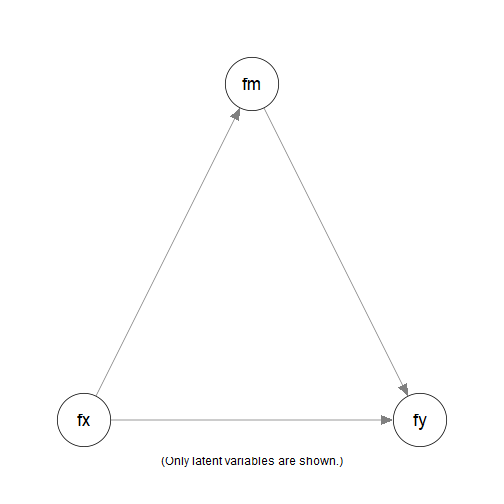
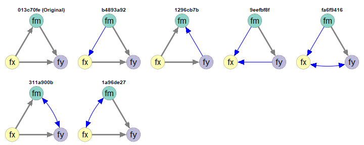
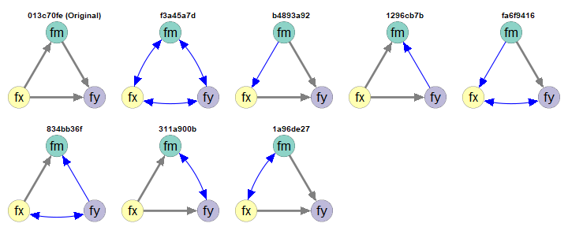

# Workflow Demo: 3 Latent Variables

## Introduction

This article is part of a [series of
articles](https://sfcheung.github.io/semeqmodels/articles/index.html#demonstrations)
to demonstrate how to use
[semeqmodels](https://sfcheung.github.io/semeqmodels/) to identify
models empirically equivalent to a target model, called the *original*
*model*.

NOTE: To make articles in this series self-contained, some sections are
repeated across articles.

## Scope

A simple mediation model will be used as an example. This model is
trivial, but is simple enough to illustrate how to use `semeqmodels`.

## Original Model

Suppose this the original model we fitted to dataset
`data_test_3_factor_3_item` (installed with the package):

``` r

library(semeqmodels)
round(head(data_test_3_factor_3_item), 2)
#>      x1    x2    x3    m1    m2    m3    y1    y2    y3
#> 1 -2.13 -1.21 -0.05  1.88  0.99  0.40  3.24  2.23  1.44
#> 2 -1.77 -0.91 -0.23 -0.02  0.12 -0.33  0.85 -0.71 -0.72
#> 3 -0.54  0.69 -0.10 -0.33 -0.34  2.31 -1.35 -0.02  0.76
#> 4 -1.72 -1.04  0.07  0.11 -0.13 -0.28 -0.49  1.77  0.64
#> 5 -0.44 -0.41 -0.12 -0.34 -0.27  0.57  2.43 -0.11 -0.20
#> 6  1.42  1.24  0.78  0.47 -0.38  1.72  0.68  1.22 -1.16
```



Simple Mediation Model

This is a model:

``` r

mod <-
"
fx =~ x1 + x2 + x3
fm =~ m1 + m2 + m3
fy =~ y1 + y2 + y3
fm ~ fx
fy ~ fm + fx
"
```

This is the lavaan results for the model:

``` r

library(lavaan)
fit <- sem(
  model = mod,
  data = data_test_3_factor_3_item
)
fit
#> lavaan 0.7-2.3166 ended normally after 41 iterations
#> 
#>   Estimator                                         ML
#>   Optimization method                           NLMINB
#>   Number of model parameters                        21
#> 
#>   Number of observations                           200
#> 
#> Model Test User Model:
#>                                                       
#>   Test statistic                                24.970
#>   Degrees of freedom                                24
#>   P-value (Chi-square)                           0.407
#>                                                       
#>   Browne's residual (NT model-based) test             
#>   Test statistic                                23.788
#>   Degrees of freedom                                24
#>   P-value (Chi-square)                           0.474
```

## Empirical Equivalence

Suppose we are would like to find *some* models that are *empirically*
*equivalent* to this model:

In this package, two models are defined to be empirically equivalent if
the following conditions are met:

- They have the same model degrees of freedom.

- Their absolute differences on selected fit measures are equal to or
  smaller than a user-defined tolerance.

See [this section](#equivalence-in-principle-and-empirical-equivalence)
on a discussion of equivalence

We will start the demonstration using model $`\chi^2`$, with a tolerance
of 0.00001.

## Generating Empirically Equivalent Models

To generate models that are empirically equivalent to a fitted model, we
can simply call
[`eq_models()`](https://sfcheung.github.io/semeqmodels/reference/eq_models.md)
and set `original_model` to the output of `lavaan`:

``` r

library(semeqmodels)
out <- eq_models(
  original_model = fit
)
```

The search can be customized if necessary. Please refer to the help page
of
[`eq_models()`](https://sfcheung.github.io/semeqmodels/reference/eq_models.md)
for available options.

This is the text output:

``` r

out
#> 
#> Number of models: 13
#> 
#> The models:
#> 
#>    Model   
#> 1  74f316e6
#> 2  aaa762b0
#> 3  f3a45a7d
#> 4  bc0d3b3c
#> 5  b4893a92
#> 6  1296cb7b
#> 7  013c70fe
#> 8  9eefbf8f
#> 9  fa6f9416
#> 10 31ffe311
#> 11 834bb36f
#> 12 311a900b
#> 13 1a96de27 
#> 
#> NOTE: 'default' names are used. Call 'print()' and add 'names_to_use =
#> "long"' to use the long descriptive names, if available, for the
#> models.
```

The default names are generated to uniquely identify the models. Treat
them as identification numbers. They are useful IDs because they are
short. However, it is much easier to examine the models by drawing them.

The function
[`eq_chisq()`](https://sfcheung.github.io/semeqmodels/reference/eq_partables_helpers.md)
can be used to extract the model $`\chi^2`$s, to verify that they have
model $`\chi^2`$s close to the that of the original model:

``` r

eq_chisq(out)
#> 74f316e6 aaa762b0 f3a45a7d bc0d3b3c b4893a92 1296cb7b 013c70fe 9eefbf8f 
#> 24.97025 24.97025 24.97025 24.97025 24.97025 24.97025 24.97025 24.97025 
#> fa6f9416 31ffe311 834bb36f 311a900b 1a96de27 
#> 24.97025 24.97025 24.97025 24.97025 24.97025
```

``` r

fitMeasures(fit, "chisq")
#> chisq 
#> 24.97
```

These models also have model degrees of freedom equal to that of the
original model:

``` r

eq_df(out)
#> 74f316e6 aaa762b0 f3a45a7d bc0d3b3c b4893a92 1296cb7b 013c70fe 9eefbf8f 
#>       24       24       24       24       24       24       24       24 
#> fa6f9416 31ffe311 834bb36f 311a900b 1a96de27 
#>       24       24       24       24       24
```

## Drawing the Models

To draw the models, the function
[`partables_plots()`](https://sfcheung.github.io/semeqmodels/reference/plot_partables.md)
can be used. It used the function
[`semPlot::semPaths()`](https://rdrr.io/pkg/semPlot/man/semPaths.html)
from the `semPlot` package to draw the model. Therefore, basic knowledge
of
[`semPlot::semPaths()`](https://rdrr.io/pkg/semPlot/man/semPaths.html)
is required.

To draw the model, we need a common layout, in the form of a matrix of
names:

``` r

# Set the layout of the plots
m <- matrix(
  c(  NA, "fm",   NA,
    "fx",   NA, "fy"),
  nrow = 2,
  ncol = 3,
  byrow = TRUE)
m
#>      [,1] [,2] [,3]
#> [1,] NA   "fm" NA  
#> [2,] "fx" NA   "fy"
```

We can then generate the plots:

``` r

p <- partables_plots(
  out,
  original_model = fit,
  structural = TRUE,
  layout = m,
  label.cex = 1.8,
  sizeLat = 11,
  edge.width = 5,
  asize = 5
)
```

We can then call
[`plot()`](https://rdrr.io/r/graphics/plot.default.html) to plot the
models. By default, they will be drawn one by one. To draw them in a
grid, use the arguments `ncol` and `nrow`:

``` r

plot(
  p,
  ncol = 5,
  nrow = 3,
  title_adj = 2
)
```


Empirically Equivalent Models

The model labelled `Original` is the original model. The other models
are empirically equivalent to this model in this dataset.

By default:

- Paths or covariances different form the original model are colored.

- Covariances are displayed using curves.

There are other ways to customize how the models are drawn. Please refer
to the help page of
[`plot.partables_plots()`](https://sfcheung.github.io/semeqmodels/reference/plot_partables.md).

## Filter the Models

The package `semeqmodels` has functions for selecting models, listed
[here](https://sfcheung.github.io/semeqmodels/reference/partable_select.md).
They can also be used to filter the output of `partables_plot()`. Some
of them are demonstrated below.

### `fx` Must Not Be a DV (`y`-variables)

Suppose that we have reasons to argue that `fx` cannot be an outcome of
any other variables in the model. For example, `fx` is measured one
month before the other variables.

We can use
[`must_not_be_y()`](https://sfcheung.github.io/semeqmodels/reference/partable_select.md)
to specify variables that cannot be a “DV.”

``` r

p1 <- p |>
  must_not_be_y(
    vars = "fx"
  )
plot(
  p1,
  ncol = 5,
  nrow = 2,
  title_adj = 2
)
```


fx Must Not Be a y-Variable

Note: A variable is a “DV” if it appears as the outcome of at least one
other variable. Therefore, a mediator is also a DV.

### `fy` Must Be a DV (`y`-variables)

Suppose that we have reasons to argue that `fy` must be an outcome of at
least one other variable.

We can use
[`must_be_y()`](https://sfcheung.github.io/semeqmodels/reference/partable_select.md)
to specify variables that must be a “DV.”

``` r

p2 <- p |>
  must_be_y(
    vars = "fy"
  )
plot(
  p2,
  ncol = 5,
  nrow = 2,
  title_adj = 2
)
```



fy Must Be a y-Variable

### Must Not Have Any Paths from `fy` to `fx`

Suppose that, theoretically, `fy` cannot have any effect on `fx`,
directly or indirectly. We can use
[`must_not_have_paths()`](https://sfcheung.github.io/semeqmodels/reference/partable_select.md).

``` r

p3 <- p |>
  must_not_have_paths(
    y_on_x = "fx ~ fy"
  )
plot(
  p3,
  ncol = 5,
  nrow = 2,
  title_adj = 2
)
```



No Paths from fy to fx

### Chaining the Selections

The selectors can be chained together using `|>`.

``` r

p5 <- p |>
  must_have_paths(
    y_on_x = "fy ~ fx"
  ) |>
  must_not_be_y(
    vars = "fx"
  )
plot(
  p5,
  ncol = 5,
  nrow = 1,
  title_adj = 2
)
```


Chained Filter

## Final Remarks

### Customize the Search

There are many other ways to customize the search and the plots. Please
refer to the corresponding halp pages for details.

Demonstrations of other models and cases can be found in the [other
demonstration
articles](https://sfcheung.github.io/semeqmodels/articles/index.html#demonstrations)

### Equivalence-In-Principle and Empirical Equivalence

The concept of mathematically equivalence models, or two models being
equivalent in principle (Lee & Hershberger, 1990), has a long history in
the literature on structural equation modeling Williams (2012). Two
models are considered to be mathematically equivalent if they
necessarily imply the same covariance matrix regardless of the data.
There are methods to generate them and tools to generate them
automatically (e.g., Lee & Hershberger, 1990).

Our definition of empirical equivalence is similar to *empirical
occurrence of equivalence* (EOE, Lee & Hershberger, 1990). However, we
include the requirement of equal degrees of freedom: two models must
also be equal in parsimony. We also allow for the possibility of using
any fit measures deem appropriate (e.g., CFI, RMSEA), and also the use
of tolerance values that are appropriate for a situation.

Although our focus is on empirical equivalence, two models that are
mathematically equivalent in the conventional sense are necessarily
empirically equivalent. Note that the reverse is not true: two models
that are empirically equivalent are not necessarily mathematically
equivalent.

Nevertheless, when the tolerance is set to be very small, the models
identified, though not necessarily, are likely to be mathematically
equivalent. Therefore, the package can also be used to identify models
that are likely mathematically equivalent.

## Reference(s)

Lee, S., & Hershberger, S. (1990). A simple rule for generating
equivalent models in covariance structure modeling. *Multivariate
Behavioral Research*, *25*(3), 313–334.
<https://doi.org/10.1207/s15327906mbr2503_4>

MacCallum, R. C., Wegener, D. T., Uchino, B. N., & Fabrigar, L. R.
(1993). The problem of equivalent models in applications of covariance
structure analysis. *Psychological Bulletin*, *114*(1), 185–199.
<https://doi.org/10.1037/0033-2909.114.1.185>

Williams, L. J. (2012). Equivalent models: Concepts, problems,
alternatives. In R. H. Hoyle (Ed.), *Handbook of Structural Equation
Modeling*. The Guilford Press.
