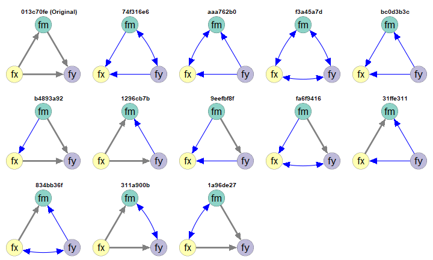
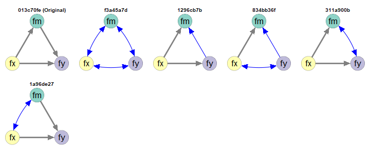
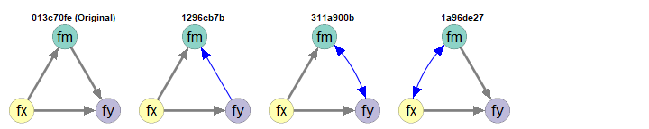

# Introduction

This article is part of a series of
articles to demonstrate how to
use [semeqmodels](https://sfcheung.github.io/semeqmodels/)
to identify models empirically equivalent
to a target model, called the *original* *model*.

NOTE: To make articles in this series
self-contained, some sections are repeated
across articles.

# Scope

A simple mediation model
will be used as an example. This model
is trivial, but is simple enough to
illustrate how to use `semeqmodels`.

# Original Model

Suppose this the original model we fitted
to dataset `data_test_3_factor_3_item`
(come with the package):

<div class="figure" style="text-align: center">

<p class="caption">Simple Mediation Model</p>
</div>

This is a model:


``` r
mod <-
"
fx =~ x1 + x2 + x3
fm =~ m1 + m2 + m3
fy =~ y1 + y2 + y3
fm ~ fx
fy ~ fm + fx
"
```

This is the lavaan results for the model:


``` r
library(lavaan)
fit <- sem(
  model = mod,
  data = data_test_3_factor_3_item
)
fit
#> lavaan 0.7-1.3032 ended normally after 41 iterations
#> 
#>   Estimator                                         ML
#>   Optimization method                           NLMINB
#>   Number of model parameters                        21
#> 
#>   Number of observations                           200
#> 
#> Model Test User Model:
#>                                                       
#>   Test statistic                                24.970
#>   Degrees of freedom                                24
#>   P-value (Chi-square)                           0.407
```


# Empirical Equivalence

Suppose we are would like to find *some*
models that are *empirically*
*equivalent* to this model:

Two models are empirically equivalent
if the following conditions are met:

- They have the same model degrees of freedom.

- Their absolute differences on selected
  fit measures are equal to or smaller than
  a user-defined tolerance.

We will start the demonstration using
model $\chi^2$, with a tolerance of
0.00001.

# Generating Empirically Equivalent Models

To generate models that are empirically
equivalent to a fitted model, we can simply
call `eq_models()` and set `original_model`
to the output of `lavaan`:


``` r
library(semeqmodels)
out <- eq_models(
  original_model = fit
)
```

The search can be customized if necessary.
Please refer to the help page of `eq_models()`
for available options.

This is the text output:


``` r
out
#> 
#> Number of models: 13
#> 
#> The models:
#> 
#>    Model   
#> 1  74f316e6
#> 2  aaa762b0
#> 3  f3a45a7d
#> 4  bc0d3b3c
#> 5  b4893a92
#> 6  1296cb7b
#> 7  013c70fe
#> 8  9eefbf8f
#> 9  fa6f9416
#> 10 31ffe311
#> 11 834bb36f
#> 12 311a900b
#> 13 1a96de27 
#> 
#> NOTE: 'default' names are used. Call 'print()' and add 'names_to_use =
#> "long"' to use the long descriptive names, if available, for the
#> models.
```

The default names are generated to uniquely
identify the models. Treat them as identification
numbers. They are useful IDs because they
are short. However, it is much easier
to examine the models by drawing them.

# Drawing the Models

To draw the models, the function
`partables_plots()` can be used. It used
the package `semPlot` to draw the model.
Therefore, basic knowledge of this package
is required.

To draw the model, we need a common layout,
in the form of a matrix of names:


``` r
# Set the layout of the plots
m <- matrix(
  c(  NA, "fm",   NA,
    "fx",   NA, "fy"),
  nrow = 2,
  ncol = 3,
  byrow = TRUE)
m
#>      [,1] [,2] [,3]
#> [1,] NA   "fm" NA  
#> [2,] "fx" NA   "fy"
```

We can then generate the plots:


``` r
p <- partables_plots(
  out,
  original_model = fit,
  structural = TRUE,
  layout = m,
  label.cex = 1.8,
  sizeLat = 11,
  edge.width = 5,
  asize = 5
)
```

We can then call `plot()` to plot
the models. By default, they will be drawn
one by one. To draw them in a grid,
use the arguments `ncol` and `nrow`:


``` r
plot(
  p,
  ncol = 5,
  nrow = 3,
  title_adj = 2
)
```

<div class="figure" style="text-align: center">

<p class="caption">Empirically Equivalent Models</p>
</div>

The model labelled `Original` is the
original model. The other models are
empirically equivalent to this model
in this dataset.

By default:

- Paths or covariances different form
  the original model are colored.

- Covariances are displayed using curves.

There are other ways to customize how
the models are drawn. Please refer to
the help page of `plot.partables_plots()`.

# Filter the Models

The package `semeqmodels`
has functions for selecting
models, listed [here](../reference/partable_select.html).
They can also be used to filter the
output of `partables_plot()`. Some of them
are demonstrated below.

## `fx` Must Not Be a DV (`y`-variables)

Suppose that we have reasons to argue that
`fx` cannot be an outcome of any other
variables in the model. For example, `fx` is measured
one month before the other variables.

We can use `must_not_be_y()` to specify
variables that cannot be a "DV."


``` r
p1 <- p |>
  must_not_be_y(
    vars = "fx"
  )
plot(
  p1,
  ncol = 5,
  nrow = 2,
  title_adj = 2
)
```

<div class="figure" style="text-align: center">

<p class="caption">fx Must Not Be a y-Variable</p>
</div>

Note: A variable is a "DV" if it appears
as the outcome of at least one other
variable. Therefore, a mediator is also
a DV.

## `fy` Must Be a DV (`y`-variables)

Suppose that we have reasons to argue that
`fy` must be an outcome of at least one other
variable.

We can use `must_be_y()` to specify
variables that must be a "DV."


``` r
p2 <- p |>
  must_be_y(
    vars = "fy"
  )
plot(
  p2,
  ncol = 5,
  nrow = 2,
  title_adj = 2
)
```

<div class="figure" style="text-align: center">

<p class="caption">fy Must Be a y-Variable</p>
</div>

## Must Not Have Any Paths from `fy` to `fx`

Suppose that, theoretically, `fy` cannot
have any effect on `fx`, directly or indirectly.
We can use `must_not_have_paths()`.


``` r
p3 <- p |>
  must_not_have_paths(
    y_on_x = "fx ~ fy"
  )
plot(
  p3,
  ncol = 5,
  nrow = 2,
  title_adj = 2
)
```

<div class="figure" style="text-align: center">

<p class="caption">No Paths from fy to fx</p>
</div>

## Chaining the Selection

The selectors can be chained together
using `|>`.


``` r
p5 <- p |>
  must_have_paths(
    y_on_x = "fy ~ fx"
  ) |>
  must_not_be_y(
    vars = "fx"
  )
plot(
  p5,
  ncol = 5,
  nrow = 1,
  title_adj = 2
)
```

<div class="figure" style="text-align: center">

<p class="caption">Chained Filter</p>
</div>


# Final Remarks

There are many other ways to customize
the search and the plots. Please refer
to the corresponding halp pages for
details.


# Reference(s)
