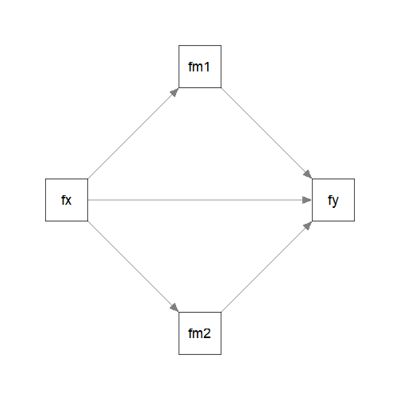
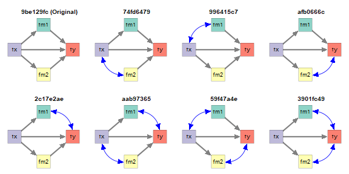
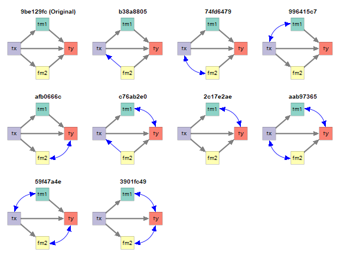
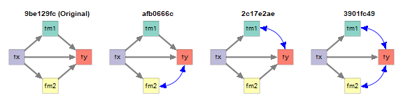

# Introduction

This article is part of
a [series of articles](./index.html#demonstrations)
to demonstrate how to
use [semeqmodels](https://sfcheung.github.io/semeqmodels/)
to identify models empirically equivalent
to a target model, called the *original* *model*.

NOTE: To make articles in this series
self-contained, some sections are repeated
across articles.

# Scope

A parallel mediation model
will be used as an example to
illustrate how to use `semeqmodels`.

# Original Model

Suppose this the original model we fitted
to dataset `data_test_4obvs`
(installed with the package):

<div class="figure" style="text-align: center">

<p class="caption">Parallel Mediation Model</p>
</div>

This is the model:


``` r
mod <-
"
fm1 ~ fx
fm2 ~ fx
fy ~ fm1 + fm2 + fx
"
```

This is the lavaan results for the model:


``` r
library(lavaan)
fit <- sem(
  model = mod,
  data = data_test_4obvs,
  fixed.x = FALSE
)
fit
#> lavaan 0.7-1.3032 ended normally after 1 iteration
#> 
#>   Estimator                                         ML
#>   Optimization method                           NLMINB
#>   Number of model parameters                         9
#> 
#>   Number of observations                           500
#> 
#> Model Test User Model:
#>                                                       
#>   Test statistic                                 1.537
#>   Degrees of freedom                                 1
#>   P-value (Chi-square)                           0.215
```


NOTE: For now, `semeqmodels` only support
models fitted with `fixed.x = FALSE`,
such that all observed variables can be
freely changed.


# Empirical Equivalence

Suppose we are would like to find *some*
models that are *empirically*
*equivalent* to this model:

In this package,
two models are defined to be empirically equivalent
if the following conditions are met:

- They have the same model degrees of freedom.

- Their absolute differences on selected
  fit measures are equal to or smaller than
  a user-defined tolerance.

See [this section](#equivalence-in-principle-and-empirical-equivalence)
on a discussion of equivalence

We will start the demonstration using
model $\chi^2$, with a tolerance of
0.00001.


# Generating Empirically Equivalent Models

To generate models that are empirically
equivalent to a fitted model, we can simply
call `eq_models()` and set `original_model`
to the output of `lavaan`:


``` r
library(semeqmodels)
out <- eq_models(
  original_model = fit
)
```

The search can be customized if necessary.
Please refer to the help page of `eq_models()`
for available options.

This is the text output:


``` r
out
#> 
#> Number of models: 12
#> 
#> The models:
#> 
#>    Model   
#> 1  9be129fc
#> 2  b38a8805
#> 3  74fd6479
#> 4  996415c7
#> 5  607e59ab
#> 6  afb0666c
#> 7  29a5f63b
#> 8  c76ab2e0
#> 9  2c17e2ae
#> 10 aab97365
#> 11 59f47a4e
#> 12 3901fc49 
#> 
#> NOTE: 'default' names are used. Call 'print()' and add 'names_to_use =
#> "long"' to use the long descriptive names, if available, for the
#> models.
```

The default names are generated to uniquely
identify the models. Treat them as identification
numbers. They are useful IDs because they
are short. However, it is much easier
to examine the models by drawing them.

The function `eq_chisq()` can be used
to extract the model $\chi^2$s, to verify
that they have model $\chi^2$s close to
the that of the original model:


``` r
eq_chisq(out)
#> 9be129fc b38a8805 74fd6479 996415c7 607e59ab afb0666c 29a5f63b c76ab2e0 
#> 1.536571 1.536571 1.536571 1.536571 1.536571 1.536571 1.536571 1.536571 
#> 2c17e2ae aab97365 59f47a4e 3901fc49 
#> 1.536571 1.536571 1.536571 1.536571
```


``` r
fitMeasures(fit, "chisq")
#> chisq 
#> 1.537
```

These models also have model degrees of
freedom equal to that of the original
model:


``` r
eq_df(out)
#> 9be129fc b38a8805 74fd6479 996415c7 607e59ab afb0666c 29a5f63b c76ab2e0 
#>        1        1        1        1        1        1        1        1 
#> 2c17e2ae aab97365 59f47a4e 3901fc49 
#>        1        1        1        1
```


# Drawing the Models

To draw the models, the function
`partables_plots()` can be used. It used
the function `semPlot::semPaths()`
from the `semPlot` package to draw the model.
Therefore, basic knowledge of
`semPlot::semPaths()` is required.

To draw the model, we need a common layout,
in the form of a matrix of names:


``` r
# Set the layout of the plots
m <- matrix(
  c(  NA, "fm1",   NA,
    "fx",   NA, "fy",
      NA, "fm2",   NA),
  nrow = 3,
  ncol = 3,
  byrow = TRUE)
m
#>      [,1] [,2]  [,3]
#> [1,] NA   "fm1" NA  
#> [2,] "fx" NA    "fy"
#> [3,] NA   "fm2" NA
```

We can then generate the plots:


``` r
p <- partables_plots(
  out,
  original_model = fit,
  layout = m,
  label.cex = 1.2,
  sizeMan = 11,
  edge.width = 5,
  asize = 5,
  curve_cov_settings = list(base_curve = 4)
)
```

The argument `curve_cov_settings`,
with `list(base_curve = 4)`, is used to
make the curves for covariances easier
to read.


We can then call `plot()` to plot
the models. By default, they will be drawn
one by one. To draw them in a grid,
use the arguments `ncol` and `nrow`:


``` r
plot(
  p,
  ncol = 4,
  nrow = 3,
  title_adj = 2
)
```

<div class="figure" style="text-align: center">

<p class="caption">Empirically Equivalent Models</p>
</div>


The model labelled `Original` is the
original model. The other models are
empirically equivalent to this model
in this dataset.

By default:

- Paths or covariances different form
  the original model are colored.

- Covariances are displayed using curves.

There are other ways to customize how
the models are drawn. Please refer to
the help page of `plot.partables_plots()`.


# Filter the Models

The package `semeqmodels`
has functions for selecting
models, listed [here](../reference/partable_select.html).
They can also be used to filter the
output of `partables_plot()`. Some of them
are demonstrated below.

## `fx` Must Not Be a DV (`y`-variables)

Suppose that we have reasons to argue that
`fx` cannot be an outcome of any other
variables in the model. For example, `fx` is measured
one month before the other variables.

We can use `must_not_be_y()` to specify
variables that cannot be a "DV."


``` r
p1 <- p |>
  must_not_be_y(
    vars = "fx"
  )
plot(
  p1,
  ncol = 4,
  nrow = 2,
  title_adj = 2
)
```

<div class="figure" style="text-align: center">

<p class="caption">fx Must Not Be a y-Variable</p>
</div>

Note: A variable is a "DV" if it appears
as the outcome of at least one other
variable. Therefore, a mediator is also
a DV.

## Must Have Some Direct Paths

Suppose that we have theoretical reasons to argue that
`fm1` and `fm2` must be affected directly
by `fx`, and so would like to keep models
with these two paths.

We can use `have_pars_all()` to specify
paths that must be present in a model


``` r
p2 <- p |>
  have_pars_all(
    pars = c("fm1 ~ fx",
             "fm2 ~ fx")
  )
plot(
  p2,
  ncol = 4,
  nrow = 1,
  title_adj = 2
)
```

<div class="figure" style="text-align: center">

<p class="caption">Some Paths Must Be Present</p>
</div>

## Must Not Have Any Paths from `fm1` to `fm2`

Suppose that, theoretically, `fm1` cannot
have any effect on `fm2`, directly or indirectly.
We can use `must_not_have_paths()`.


``` r
p3 <- p |>
  must_not_have_paths(
    y_on_x = "fm2 ~ fm1"
  )
plot(
  p3,
  ncol = 4,
  nrow = 3,
  title_adj = 2
)
```

<div class="figure" style="text-align: center">

<p class="caption">No Paths from fm1 to fm2</p>
</div>

## Chaining the Selections

The selectors can be chained together
using `|>`.


``` r
p5 <- p |>
  must_not_be_y(
    vars = "fx"
  ) |>
  have_pars_all(
    pars = c("fm1 ~ fx",
             "fm2 ~ fx")
  ) |>
  must_not_have_paths(
    y_on_x = "fm2 ~ fm1"
  )
plot(
  p5,
  ncol = 4,
  nrow = 1,
  title_adj = 2
)
```

<div class="figure" style="text-align: center">

<p class="caption">Chained Filter</p>
</div>


# Final Remarks

## Customize the Search

There are many other ways to customize
the search and the plots. Please refer
to the corresponding halp pages for
details.

Demonstrations of other models and
cases can be found in
the [other demonstration articles](./index.html#demonstrations)

## Equivalence-In-Principle and Empirical Equivalence

The concept of mathematically
equivalence models, or two models
being equivalent in principle [@lee_simple_1990],
has
a long history in the literature on
structural equation modeling
[@maccallum_problem_1993, @williams_equivalent_2012].
Two models are considered to be
mathematically equivalent
if they necessarily imply the same
covariance matrix regardless of the data.
There are methods to generate them and
tools to generate them automatically
[e.g., @lee_simple_1990].

Our definition of empirical equivalence
is similar to *empirical occurrence of equivalence*
[EOE, @lee_simple_1990]. However, we include
the requirement of equal degrees of freedom:
two models must also be equal in parsimony.
We also allow for the possibility of using
any fit measures deem appropriate (e.g., CFI,
RMSEA), and also the use of tolerance values
that are appropriate for a situation.

Although our focus is on empirical equivalence,
two models that are mathematically equivalent in the
conventional sense are necessarily
empirically equivalent.
Note that the reverse is
not true: two models that are empirically
equivalent are not necessarily mathematically
equivalent.

Nevertheless, when the tolerance is set to
be very small, the models identified,
though not necessarily, are likely to be
mathematically equivalent. Therefore,
the package can also be used to identify
models that are likely mathematically
equivalent.


# Reference(s)
