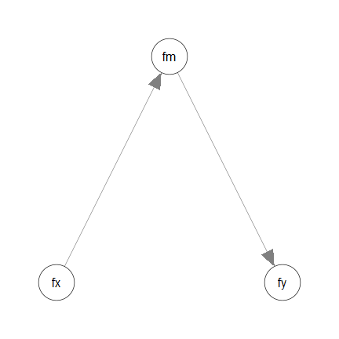
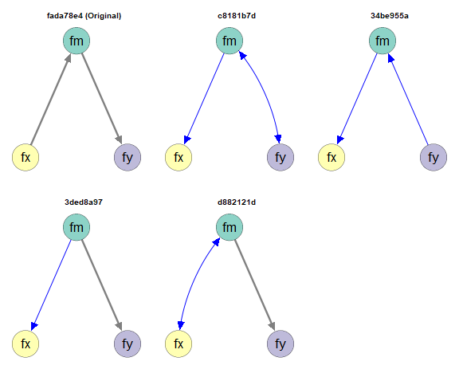
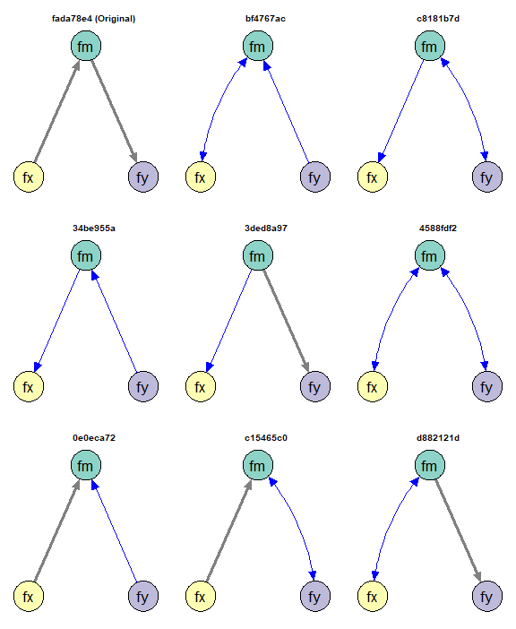
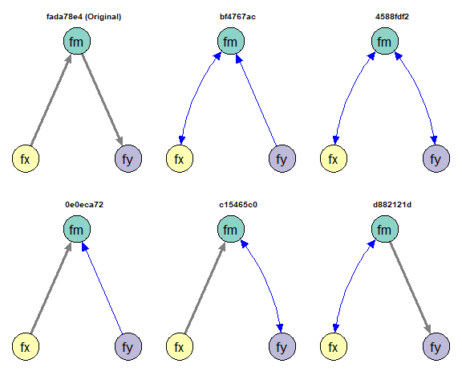

# Introduction

This article is a brief illustration of how
to use `semeqmodels()`
from the package
[semeqmodels](https://sfcheung.github.io/semeqmodels/)
to find empirically equivalent models
of a model fitted by structural
equation modeling using `lavaan`.

# Data

A test dataset of `semeqmodels` will be
used for illustration:


``` r
library(semeqmodels)
packageVersion("semeqmodels")
#> [1] '0.0.1.5'
head(round(data_test_3_factor_3_item, 2))
#>      x1    x2    x3    m1    m2    m3    y1    y2    y3
#> 1 -2.13 -1.21 -0.05  1.88  0.99  0.40  3.24  2.23  1.44
#> 2 -1.77 -0.91 -0.23 -0.02  0.12 -0.33  0.85 -0.71 -0.72
#> 3 -0.54  0.69 -0.10 -0.33 -0.34  2.31 -1.35 -0.02  0.76
#> 4 -1.72 -1.04  0.07  0.11 -0.13 -0.28 -0.49  1.77  0.64
#> 5 -0.44 -0.41 -0.12 -0.34 -0.27  0.57  2.43 -0.11 -0.20
#> 6  1.42  1.24  0.78  0.47 -0.38  1.72  0.68  1.22 -1.16
```

# Model

Suppose we are going to fit a model
with three latent variables:




``` r
mod <-
"
fx =~ x1 + x2 + x3
fm =~ m1 + m2 + m3
fy =~ y1 + y2 + y3
fm ~ fx
fy ~ fm
"
```


``` r
library(lavaan)
fit <- sem(
  model = mod,
  data = data_test_3_factor_3_item
)
fit
#> lavaan 0.7-2.3166 ended normally after 40 iterations
#> 
#>   Estimator                                         ML
#>   Optimization method                           NLMINB
#>   Number of model parameters                        20
#> 
#>   Number of observations                           200
#> 
#> Model Test User Model:
#>                                                       
#>   Test statistic                                25.503
#>   Degrees of freedom                                25
#>   P-value (Chi-square)                           0.434
#>                                                       
#>   Browne's residual (NT model-based) test             
#>   Test statistic                                24.070
#>   Degrees of freedom                                25
#>   P-value (Chi-square)                           0.515
```


# Empirical Equivalence

Suppose we would like to find *some*
models that are *empirically*
*equivalent* to this model:

In this package,
two models are defined to be empirically equivalent
if the following conditions are met:

- They have the same model degrees of freedom.

- Their absolute differences on selected
  fit measures are equal to or smaller than
  a user-defined tolerance.

See [this section](#equivalence-in-principle-and-empirical-equivalence)
on a discussion of equivalence

We will start the demonstration using
model $\chi^2$, with a tolerance of
0.00001.

# Example 1: Model Chi-Squares

## Calling `eq_models()`

To find a list of models that are empirically
equivalent to the model fitted above, based
on model $\chi^2$, the default,
we can use `eq_models()`:


``` r
mod_eq <- eq_models(
  original_model = fit
)
```

For large models, this process can take
some time to run (can be over ten minutes for
complicated models) because the number of
possible models can be several hundreds
or even several thousands.

## Examine the Models

The output is a list of models, defined
by `lavaan` parameter tables:


``` r
mod_eq
#> 
#> Number of models: 5
#> 
#> The models:
#> 
#>   Model   
#> 1 c8181b7d
#> 2 34be955a
#> 3 3ded8a97
#> 4 d882121d
#> 5 fada78e4 
#> 
#> NOTE: 'default' names are used. Call 'print()' and add 'names_to_use =
#> "long"' to use the long descriptive names, if available, for the
#> models.
```

For a more readable printout, call `print()`
and add `names_to_use = "long"`:


``` r
print(mod_eq,
      names_to_use = "long")
#> 
#> Number of models: 5
#> 
#> The models:
#> 
#> Model
#> 1 c8181b7d := original, drop:fm~fx, add:fx~~fm, drop:fy~fm, add:fm~~fy,
#>     drop:fx~~fm, add:fx~fm, drop:fm~~fy, add:fm~fy, drop:fm~fy,
#>     add:fm~~fy
#> 2 34be955a := original, drop:fm~fx, add:fx~~fm, drop:fy~fm, add:fm~~fy,
#>     drop:fx~~fm, add:fx~fm, drop:fm~~fy, add:fm~fy
#> 3 3ded8a97 := original, drop:fm~fx, add:fx~~fm, drop:fy~fm, add:fm~~fy,
#>     drop:fx~~fm, add:fx~fm, drop:fm~~fy, add:fy~fm
#> 4 d882121d := original, drop:fm~fx, add:fx~~fm, drop:fy~fm, add:fm~~fy,
#>     drop:fm~~fy, add:fy~fm
#> 5 fada78e4 := original
```

The long names show the modifications
from the original model to the final
models.

By default, the original model is not
removed, although it may still be shown
with steps of modifications.

The function `eq_df()` can be used to
retrieve the model *df*s:


``` r
eq_df(mod_eq)
#> c8181b7d 34be955a 3ded8a97 d882121d fada78e4 
#>       25       25       25       25       25
```

As expected, all models have the same model
*df*s.

The function `eq_chisq()` can be used
to retrieve the model $\chi^2$s of
the models:


``` r
eq_chisq(mod_eq)
#> c8181b7d 34be955a 3ded8a97 d882121d fada78e4 
#> 25.50339 25.50339 25.50339 25.50339 25.50339
```

It can be confirmed that all models have
nearly the same model $\chi^2$.

Actually, in this case, the models in this
case are not just empirically equivalent.
They are also mathematically equivalent.

The function `model_diff_many()` can
be used to list the differences between
the fitted models and each of the
empirically equivalent models:


``` r
model_diff_many(
  target_model = fit,
  other_models = mod_eq
)
#> 
#> -------------
#> 
#> Models: fit vs. c8181b7d
#> 
#> Model: fit
#> fm~fx (free)
#> fy~fm (free)
#> 
#> Model: c8181b7d
#> fx~fm (free)
#> fm~~fy (free)
#> 
#> -------------
#> 
#> Models: fit vs. 34be955a
#> 
#> Model: fit
#> fm~fx (free)
#> fy~fm (free)
#> 
#> Model: 34be955a
#> fx~fm (free)
#> fm~fy (free)
#> 
#> -------------
#> 
#> Models: fit vs. 3ded8a97
#> 
#> Model: fit
#> fm~fx (free)
#> 
#> Model: 3ded8a97
#> fx~fm (free)
#> 
#> -------------
#> 
#> Models: fit vs. d882121d
#> 
#> Model: fit
#> fm~fx (free)
#> 
#> Model: d882121d
#> fm~~fx (free)
#> 
#> -------------
#> 
#> Models: fit vs. fada78e4
#> 
#> Model: fit
#> No parameter only in this model.
#> 
#> Model: fada78e4
#> No parameter only in this model.
```

A better way to see the differences is
to draw the models, described next.

## Visualize the Models

The function `partables_plots()` can
be used to visualize the models,
using `semPaths()` from the `semPlot`
package. Basic knowledge of `semPlot::semPaths()`
is required.


``` r
layout_i <- matrix(c(  NA, "fm",  NA,
                     "fx",   NA, "fy"),
                   ncol = 3,
                   nrow = 2,
                   byrow = TRUE)
p <- partables_plots(
  mod_eq,
  original_model = fit,
  layout = layout_i,
  label.cex = 1.5,
  sizeLat = 15,
  edge.width = 5,
  asize = 5,
  structural = TRUE
)
```

The `plot()` method can be used to plot
the models:


``` r
plot(
  p,
  ncol = 3,
  nrow = 2
)
```



By default, paths different from the
those in the original model will be
displayed in blue. Covariances (both
covariances and error covariances) will
be represented by curves.

# Example 2: CFI

## Calling `eq_models()` with `tolerance`

Suppose we would like to define empirical
equivalence using another fit measure,
such as CFI. This can be done using the
argument `tolerance`.


``` r
mod_eq_cfi <- eq_models(
  original_model = fit,
  tolerance = c(cfi = .01)
)
```

The argument `tolerance` accepts a
*named* numeric vector. For each element:

- The *name* is the name of a fit measure
as appeared in `lavaan::fitMeasures()`.

- The value is the maximum absolute difference
  on this fit measure for two models to be
  considered empirically equivalent.

If the vector has more than one value,
empirical equivalence is checked using
*all* fit measures specified in `tolerance`.

In this example, `c(cfi = .01)` indicates
that two models are considered empirically
equivalent if their absolute difference in
CFI is at most .01.

## Examine the Models

The output is a list of models, defined
by `lavaan` parameter tables:


``` r
mod_eq_cfi
#> 
#> Number of models: 9
#> 
#> The models:
#> 
#>   Model   
#> 1 bf4767ac
#> 2 c8181b7d
#> 3 34be955a
#> 4 3ded8a97
#> 5 4588fdf2
#> 6 0e0eca72
#> 7 c15465c0
#> 8 d882121d
#> 9 fada78e4 
#> 
#> NOTE: 'default' names are used. Call 'print()' and add 'names_to_use =
#> "long"' to use the long descriptive names, if available, for the
#> models.
```

Because a more liberal criterion is used,
the number of models is larger than when using
model $\chi^2$.


``` r
eq_df(mod_eq_cfi)
#> bf4767ac c8181b7d 34be955a 3ded8a97 4588fdf2 0e0eca72 c15465c0 d882121d 
#>       25       25       25       25       25       25       25       25 
#> fada78e4 
#>       25
```

Even with this liberal criterion, all
models still have the same model
*df*s.

The function `eq_fitMeasures()` can be used
to retrieve selected fit measure(s) of all
models:


``` r
eq_fitMeasures(
  mod_eq_cfi,
  "cfi"
)
#>     bf4767ac  c8181b7d  34be955a  3ded8a97 4588fdf2 0e0eca72 c15465c0  d882121d
#> cfi        1 0.9980126 0.9980126 0.9980126        1        1        1 0.9980126
#>      fada78e4
#> cfi 0.9980126
```

In this case, the models are no longer
necessarily mathematically equivalent
to the original model.

The function `model_diff_many()`,
introduced before, can
be used to list the differences between
the fitted models and each of the
empirically equivalent models.

## Visualize the Models

The function `partables_plots()` can
be used to visualize the models,
using `semPaths()` from the `semPlot`
package. Basic knowledge of `semPlot::semPaths()`
is required.


``` r
layout_i <- matrix(c(  NA, "fm",  NA,
                     "fx",   NA, "fy"),
                   ncol = 3,
                   nrow = 2,
                   byrow = TRUE)
p_cfi <- partables_plots(
  mod_eq_cfi,
  original_model = fit,
  layout = layout_i,
  label.cex = 1.5,
  sizeLat = 15,
  edge.width = 5,
  asize = 5,
  structural = TRUE
)
```

Let's plot all the models:


``` r
plot(
  p_cfi,
  ncol = 3,
  nrow = 3
)
```



## Selecting Models

Based on knowledge about the variables,
the research design, or theoretical
reasons, some models may need to be
removed.

For example, the factor `fx` may be measured
a certain period before `fm` and `fy`,
while `fm` and `fy` are measured in the
same wave. Therefore, `fx` cannot be
an "y"-variable ("dependent variable")
that is affected by other variables.

There is a set of model selectors
functions (see `?partable_select`) that
can be used to select models. The function
`must_not_be_y()` will be demonstrated in
this vignette.


``` r
p_cfi_fx_not_y <- must_not_be_y(
  p_cfi,
  vars = "fx"
)
```


``` r
plot(
  p_cfi_fx_not_y,
  ncol = 3,
  nrow = 2
)
```



See `?partable_select` for other ways to
select models.


# Final Remarks

## Customize the Search

There are many other ways to customize
the search and the plots. Please refer
to the corresponding help pages for
details.

Demonstrations of other models and
cases can be found in
the [other demonstration articles](https://sfcheung.github.io/semeqmodels/articles/index.html#demonstrations)

## Equivalence-In-Principle and Empirical Equivalence

The concept of mathematical
equivalence models, or two models
being equivalent in principle [@lee_simple_1990],
has
a long history in the literature on
structural equation modeling
[@maccallum_problem_1993, @williams_equivalent_2012].
Two models are considered to be
mathematically equivalent
if they necessarily imply the same
covariance matrix regardless of the data.
There are methods to generate them and
tools to generate them automatically
[e.g., @lee_simple_1990].

Our definition of empirical equivalence
is similar to *empirical occurrence of equivalence*
[EOE, @lee_simple_1990]. However, we include
the requirement of equal degrees of freedom:
two models must also be equal in parsimony.
We also allow for the possibility of using
any fit measures deemed appropriate (e.g., CFI,
RMSEA), and also the use of tolerance values
that are appropriate for a situation.

Although our focus is on empirical equivalence,
two models that are mathematically equivalent in the
conventional sense are necessarily
empirically equivalent.
Note that the reverse is
not true: two models that are empirically
equivalent are not necessarily mathematically
equivalent.

Nevertheless, when the tolerance is set to
be very small, the models identified,
though not necessarily, are likely to be
mathematically equivalent. Therefore,
the package can also be used to identify
models that are likely mathematically
equivalent.


# References
